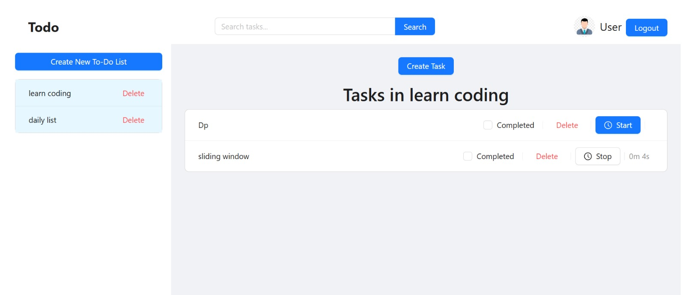
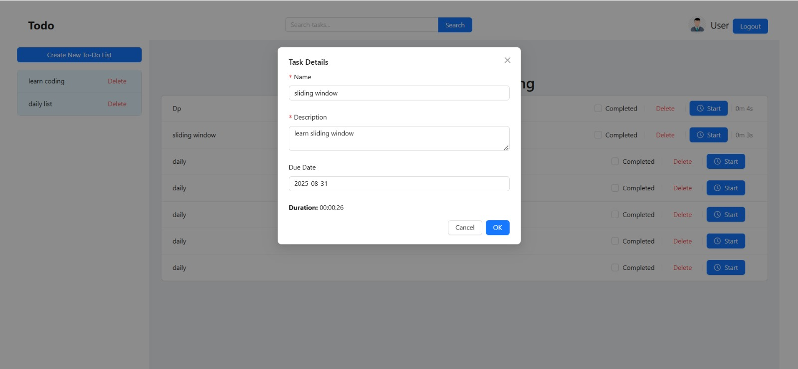
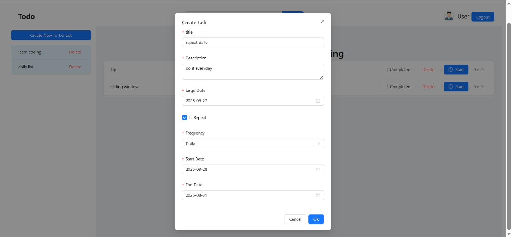
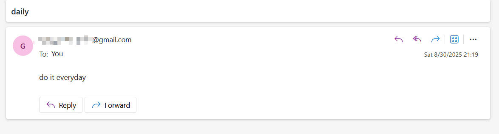
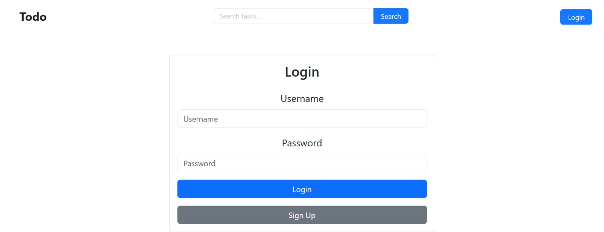
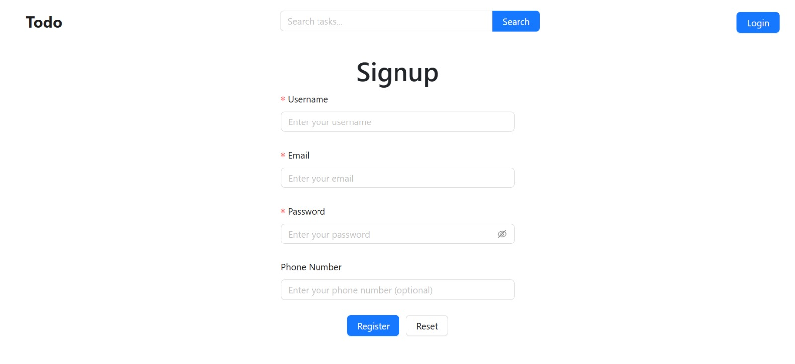
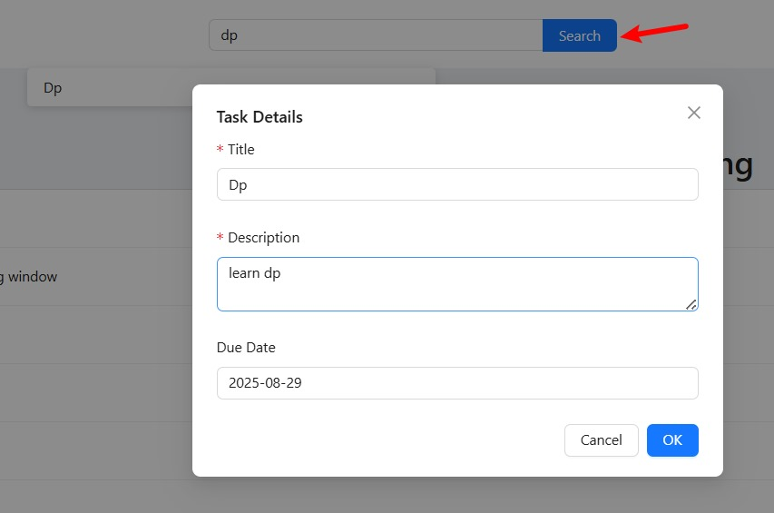

# todo project

## Overview

This is a full-stack Todo application with a React frontend and a Java backend.  
You can manage multiple to-do lists, create tasks, track time, search, and update tasks.

---

## Getting Started

### Frontend

1. Navigate to the `frontend` directory:
   ```
   cd frontend
   ```
2. Install dependencies:
   ```
   npm install
   ```
3. Start the development server:
   ```
   npm run start
   ```
4. The app will be available at [http://localhost:3000](http://localhost:3000).

---

### Backend

1. Open the backend project in your Java IDE (such as IntelliJ IDEA or Eclipse).
2. Run the main Java application (usually a Spring Boot application).
3. The backend will start on port `8080` by default.

---

## Features

- User authentication (login, signup, logout)
- Create, update, and delete to-do lists
- Create, update, and delete tasks
- Mark tasks as completed
- Track time spent on tasks (start/stop timer)
- Search tasks by content
- Repeat tasks with custom intervals and frequency
- Email notification sent on task due date

---

## Screenshots

### Dashboard

### Modify Task

### Create Task

### Email Notification

### Login

### Signup

### Search

---

## Notes

- Make sure the backend is running before starting the frontend.
- Update API endpoints in the frontend if your backend runs on a different host or port.
- Modify applications.properties.template yourself

---
